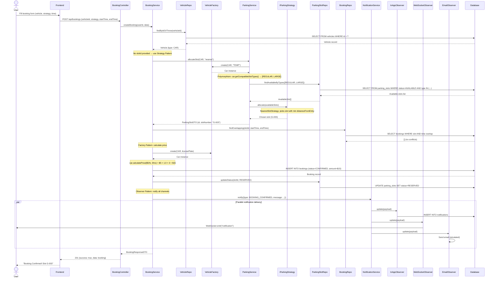

# AutoPark — Smart Parking Management System
## Project Report

---

## Table of Contents

1. Problem Statement & Solution Approach
2. Tech Stack
3. System Design & Architecture
4. SDLC (Software Development Life Cycle)
5. OOP Concepts Used
6. Design Patterns Implemented
7. SOLID Principles
8. Base Classes, Interfaces & Class Relationships
9. UML Diagrams
   - Class Diagram
   - Use Case Diagram
   - Sequence Diagram
   - ER Diagram
10. Test Cases & Results
11. Team Member Contributions

---

## 1. Problem Statement & Solution Approach

### Problem Statement

Traditional parking management systems face several critical challenges:

- **Manual slot tracking** leads to human errors, long wait times, and inefficient space utilization. Drivers waste an average of 15-20 minutes searching for parking spots.
- **No real-time visibility** — both administrators and users lack awareness of current slot availability, leading to overcrowding in some areas while others remain empty.
- **Inefficient allocation** — first-come, first-served parking ignores vehicle size compatibility (a motorcycle taking a truck-sized slot) and user preferences (nearest vs cheapest).
- **No digital booking** — walk-in-only systems cannot handle advance reservations, leading to unpredictable capacity planning.
- **Payment and tracking gaps** — manual ticketing systems are prone to fraud, lack audit trails, and provide no analytics for business decisions.
- **No notification system** — users have no way to receive real-time updates about their booking status, vehicle entry/exit, or payment confirmations.

### Solution Approach

**AutoPark** is a full-stack smart parking management system that solves these problems through:

1. **Real-Time Slot Tracking** — A live visual parking map shows slot availability across multiple floors, updated in real-time via WebSocket (Socket.IO). Slots are color-coded: green (available), red (occupied), yellow (reserved), gray (maintenance).

2. **Intelligent Slot Allocation (Strategy Pattern)** — Instead of random assignment, AutoPark uses swappable algorithms:
   - *Nearest Slot Strategy* — minimizes walking distance from entry
   - *Cheapest Slot Strategy* — optimizes for budget-conscious users
   - *Priority Slot Strategy* — balances distance and floor level for overall convenience
   
   Users select their preferred strategy at booking time, and the system automatically finds the best compatible slot.

3. **Vehicle-Aware Compatibility (Factory Pattern)** — The system understands that a Truck can only fit in LARGE slots, a Motorcycle can fit in COMPACT/REGULAR/LARGE, and an Electric Vehicle prefers ELECTRIC_CHARGING slots. The Factory Pattern creates the correct vehicle object, and polymorphism determines slot compatibility.

4. **Digital Booking Lifecycle** — Complete workflow: Book → Confirm → Check-In → Active → Check-Out → Complete, with overlap detection to prevent double-booking.

5. **Multi-Channel Notifications (Observer Pattern)** — Booking confirmations, vehicle entry/exit, and payment receipts are pushed simultaneously to in-app notifications, WebSocket (real-time popup), and email (simulated).

6. **Admin Analytics Dashboard** — Occupancy rates, revenue reports, peak hour analysis, and popular slot rankings give administrators data-driven insights.

7. **JWT-Based Security** — Access + Refresh token authentication with role-based authorization (USER vs ADMIN).

---

## 2. Tech Stack

| Layer | Technology | Purpose |
|-------|-----------|---------|
| **Frontend** | Next.js 15 (App Router) | Server-side rendering, file-based routing |
| **UI Framework** | React 19 | Component-based UI |
| **Styling** | Tailwind CSS | Utility-first CSS framework |
| **Charts** | Recharts | Admin dashboard visualizations |
| **Icons** | Lucide React | Consistent iconography |
| **Notifications** | React Hot Toast | User feedback toasts |
| **Backend** | Node.js + Express | REST API server |
| **Language** | TypeScript | Type-safe backend and frontend |
| **Database** | PostgreSQL | Relational data storage |
| **ORM** | Prisma | Type-safe database queries |
| **Real-time** | Socket.IO | WebSocket for live updates |
| **Auth** | JWT (jsonwebtoken) | Access + Refresh token auth |
| **Validation** | Zod | Runtime schema validation |
| **Password** | bcryptjs | Secure password hashing |
| **Testing** | Jest + ts-jest | Unit testing framework |

---

## 3. System Design & Architecture

### 3.1 High-Level Architecture

AutoPark follows a **3-Tier Architecture**:

```
┌─────────────────────────────────────────────────┐
│                PRESENTATION TIER                 │
│           (Next.js Frontend - Port 3000)         │
│  Landing │ Auth │ Dashboard │ Parking │ Bookings │
│  Vehicles │ Payments │ Notifications │ Admin     │
└──────────────────────┬──────────────────────────┘
                       │ HTTP REST + WebSocket
┌──────────────────────┴──────────────────────────┐
│                 APPLICATION TIER                  │
│          (Express Backend - Port 3001)           │
│                                                   │
│  ┌─────────┐  ┌─────────┐  ┌──────────────┐     │
│  │ Auth    │  │ User    │  │ Vehicle      │     │
│  │ Module  │  │ Module  │  │ Module       │     │
│  └─────────┘  └─────────┘  │ + Factory    │     │
│                             └──────────────┘     │
│  ┌──────────────┐  ┌─────────┐  ┌──────────┐   │
│  │ Parking      │  │Booking  │  │ Payment  │   │
│  │ Module       │  │ Module  │  │ Module   │   │
│  │ + Strategies │  └─────────┘  └──────────┘   │
│  └──────────────┘                                │
│  ┌──────────────────┐  ┌──────────┐             │
│  │ Notification     │  │ Report   │             │
│  │ Module           │  │ Module   │             │
│  │ + Observers      │  └──────────┘             │
│  └──────────────────┘                            │
└──────────────────────┬──────────────────────────┘
                       │ Prisma ORM
┌──────────────────────┴──────────────────────────┐
│                   DATA TIER                       │
│              (PostgreSQL Database)                │
│   users │ vehicles │ parking_floors │ parking_    │
│   slots │ bookings │ payments │ entry_exit_logs  │
│   │ notifications                                │
└─────────────────────────────────────────────────┘
```

### 3.2 Backend Layered Architecture (Per Module)

Each backend module follows a strict **layered separation**:

```
  HTTP Request
       │
       ▼
┌─────────────────┐
│   Controller    │  ← Handles HTTP request/response (extends BaseController)
│   (Routes)      │  ← Express Router with middleware (auth, validate)
└───────┬─────────┘
        │ DTO (validated input)
        ▼
┌─────────────────┐
│    Service      │  ← Business logic, orchestration
│                 │  ← Uses Factory, Strategy, Observer patterns
└───────┬─────────┘
        │ Prisma types
        ▼
┌─────────────────┐
│   Repository    │  ← Data access (extends BaseRepository<T>)
│                 │  ← Encapsulates all Prisma queries
└───────┬─────────┘
        │ SQL
        ▼
┌─────────────────┐
│   Database      │  ← PostgreSQL via Prisma ORM
│   (Singleton)   │  ← Single connection via DatabaseConnection
└─────────────────┘

Response flows back through:
  Repository → Service → Mapper (entity → DTO) → Controller → HTTP Response
```

### 3.3 Scalability & Performance Design Decisions

| Decision | Rationale |
|----------|-----------|
| **Singleton Database Connection** | Prevents connection pool exhaustion by ensuring only one PrismaClient instance exists |
| **Repository Pattern** | Data access is abstracted; switching from PostgreSQL to MongoDB requires only changing repository implementations |
| **Strategy Pattern for Allocation** | New allocation algorithms can be added without modifying existing code — O(1) algorithm swap at runtime |
| **Observer Pattern for Notifications** | Adding a new notification channel (SMS, Push) requires zero changes to existing notification service |
| **WebSocket for Real-Time** | Eliminates polling; slot updates are pushed to clients instantly |
| **JWT with Refresh Tokens** | Stateless authentication scales horizontally; refresh tokens minimize re-authentication |
| **Zod Validation at API Boundary** | Fails fast on invalid input before business logic executes |
| **Indexed Database Fields** | `@unique` on email, licensePlate, slotNumber ensures O(1) lookups |

### 3.4 Folder Structure

```
autopark/
├── client/                          # Next.js Frontend
│   └── src/
│       ├── app/                     # Pages (App Router)
│       │   ├── (auth)/              # Login, Register
│       │   ├── (dashboard)/         # All authenticated pages
│       │   └── admin/               # Admin-only pages
│       ├── components/              # Reusable UI components
│       ├── context/                 # React Context (Auth)
│       ├── hooks/                   # Custom hooks
│       ├── lib/                     # API client, utilities
│       └── types/                   # TypeScript interfaces
│
├── server/                          # Express Backend
│   ├── prisma/                      # Schema & seed
│   └── src/
│       ├── config/                  # Database singleton, env
│       ├── core/                    # Abstractions layer
│       │   ├── interfaces/          # IRepository, IParkingStrategy, IObserver
│       │   ├── abstract/            # BaseRepository, BaseVehicle, BaseController
│       │   ├── errors/              # Error hierarchy
│       │   └── types/               # Enums, common types
│       ├── modules/                 # Feature modules
│       │   ├── auth/                # Authentication
│       │   ├── user/                # User management
│       │   ├── vehicle/             # Vehicle CRUD + Factory + Models
│       │   ├── parking/             # Parking CRUD + Strategies
│       │   ├── booking/             # Booking lifecycle
│       │   ├── payment/             # Payment processing
│       │   ├── notification/        # Notifications + Observers
│       │   └── report/              # Analytics & reports
│       ├── middleware/              # Auth, validation, error handling
│       └── utils/                   # JWT, password, logger
│
├── shared/                          # Shared TypeScript types
└── docs/                            # Documentation
```

---

## 4. SDLC (Software Development Life Cycle)

AutoPark was developed following the **Agile SDLC** methodology with iterative phases:

### Phase 1: Planning & Requirements (Requirement Analysis)
- Identified core stakeholders: **Parking Users** (book, pay, track) and **Administrators** (manage, monitor, report)
- Defined 29 API endpoints across 8 modules
- Chose tech stack: Next.js + Express + PostgreSQL + TypeScript
- Identified design patterns to demonstrate: Singleton, Factory, Strategy, Observer, Repository

### Phase 2: System Design (Design Phase)
- Designed 3-tier architecture (Presentation → Application → Data)
- Created database schema with 8 tables and relationships
- Designed layered module architecture: Controller → Service → Repository
- Defined abstract classes and interfaces for OOP demonstration
- Planned UML diagrams: Class, Use Case, Sequence, ER

### Phase 3: Implementation (Development Phase)
Built in 4 sub-phases:

| Sub-Phase | Components Built |
|-----------|-----------------|
| **Foundation** | Monorepo setup, Prisma schema, Database singleton, Core abstractions (interfaces, abstract classes, error hierarchy) |
| **Backend Modules** | Auth → User → Vehicle (Factory) → Parking (Strategy) → Booking → Payment → Notification (Observer) → Report |
| **Frontend** | Auth pages → Dashboard layout → Parking grid → Booking flow → Vehicle management → Admin analytics |
| **Integration** | WebSocket real-time updates, Seed script, Unit tests |

### Phase 4: Testing (Testing Phase)
- **33 unit tests** across 4 test suites covering:
  - Factory Pattern (vehicle creation + polymorphism)
  - Strategy Pattern (3 allocation algorithms + substitutability)
  - Observer Pattern (attach/detach/notify + error resilience)
  - Error Hierarchy (inheritance + Liskov substitution)
- Manual integration testing of all API endpoints
- Frontend build verification (all 14 pages compile)

### Phase 5: Deployment (Deployment Phase)
- PostgreSQL hosted on **Neon** (cloud PostgreSQL)
- Application ready for deployment on Vercel (frontend) + Railway/Render (backend)
- Environment variables externalized via `.env`

### Phase 6: Maintenance
- Modular architecture enables independent module updates
- Strategy and Observer patterns allow feature additions without modifying existing code

---

## 5. OOP Concepts Used

### 5.1 Encapsulation

**Definition:** Bundling data and methods together while restricting direct access to internal state.

**Where Applied:**

| Location | How |
|----------|-----|
| `DatabaseConnection` (Singleton) | `private constructor()` prevents external instantiation. `private client: PrismaClient` is only accessible via `getClient()` method. |
| `BaseVehicle` | Properties `licensePlate`, `type`, `make`, `model`, `color` are `public readonly` — set at construction, never modified. |
| `AppError` | `statusCode` and `isOperational` are `public readonly` — immutable after construction. |
| `BaseRepository` | `protected prisma: PrismaClient` — child repositories can access it, but external code cannot. The `getModelDelegate()` method is `protected abstract` — only subclasses implement it. |
| All Repositories | Hide Prisma query complexity from services. Services call `findByUserId()` without knowing the underlying SQL. |

**Code Example — DatabaseConnection:**
```typescript
export class DatabaseConnection {
  private static instance: DatabaseConnection;  // private — no external access
  private client: PrismaClient;                 // private — hidden from consumers

  private constructor() {                       // private — cannot be instantiated
    this.client = new PrismaClient();
  }

  public static getInstance(): DatabaseConnection {  // controlled access point
    if (!DatabaseConnection.instance) {
      DatabaseConnection.instance = new DatabaseConnection();
    }
    return DatabaseConnection.instance;
  }

  public getClient(): PrismaClient {            // public getter — controlled exposure
    return this.client;
  }
}
```

### 5.2 Inheritance

**Definition:** A mechanism where a child class derives properties and methods from a parent class.

**Where Applied:**

| Parent | Children | What's Inherited |
|--------|----------|-----------------|
| `BaseVehicle` (abstract) | `Car`, `Motorcycle`, `Truck`, `ElectricVehicle` | `licensePlate`, `type`, `canFitInSlot()`, `calculatePrice()` |
| `BaseRepository<T>` (abstract) | `UserRepository`, `VehicleRepository`, `BookingRepository`, `ParkingSlotRepository`, `ParkingFloorRepository`, `PaymentRepository`, `NotificationRepository` | `findAll()`, `findById()`, `findByIdOrThrow()`, `create()`, `update()`, `delete()`, `count()` |
| `BaseController` (abstract) | `UserController`, `VehicleController`, `ParkingController`, `BookingController`, `PaymentController`, `NotificationController`, `ReportController` | `sendSuccess()`, `sendCreated()`, `sendNoContent()`, `sendPaginated()` |
| `AppError` | `NotFoundError`, `ValidationError`, `AuthenticationError`, `AuthorizationError`, `ConflictError` | `message`, `statusCode`, `isOperational`, stack trace |

**Code Example — Vehicle Inheritance:**
```typescript
// Parent (abstract)
export abstract class BaseVehicle {
  constructor(
    public readonly licensePlate: string,
    public readonly type: VehicleType,
  ) {}

  abstract getCompatibleSlotTypes(): SlotType[];  // must be implemented
  abstract getSizeMultiplier(): number;            // must be implemented

  canFitInSlot(slotType: SlotType): boolean {      // inherited by all children
    return this.getCompatibleSlotTypes().includes(slotType);
  }

  calculatePrice(basePricePerHour: number, hours: number): number {
    return basePricePerHour * this.getSizeMultiplier() * hours;
  }
}

// Child
export class Car extends BaseVehicle {
  constructor(licensePlate: string) {
    super(licensePlate, VehicleType.CAR);  // calls parent constructor
  }

  getCompatibleSlotTypes(): SlotType[] {   // implements abstract method
    return [SlotType.REGULAR, SlotType.LARGE];
  }

  getSizeMultiplier(): number {            // implements abstract method
    return 1.0;
  }
}
```

### 5.3 Polymorphism

**Definition:** Objects of different classes respond differently to the same method call.

**Where Applied:**

| Method Call | Polymorphic Behavior |
|-------------|---------------------|
| `vehicle.getCompatibleSlotTypes()` | Car → `[REGULAR, LARGE]`, Motorcycle → `[COMPACT, REGULAR, LARGE]`, Truck → `[LARGE]`, EV → `[ELECTRIC_CHARGING, REGULAR, LARGE]` |
| `vehicle.getSizeMultiplier()` | Car → `1.0`, Motorcycle → `0.5`, Truck → `2.0`, EV → `1.2` |
| `vehicle.calculatePrice(10, 2)` | Car → `$20`, Motorcycle → `$10`, Truck → `$40`, EV → `$24` (same base price, different results) |
| `strategy.allocate(slots)` | NearestStrategy → picks closest slot, CheapestStrategy → picks cheapest, PriorityStrategy → picks best score |
| `observer.update(payload)` | InAppObserver → saves to DB, WebSocketObserver → emits to socket, EmailObserver → sends email |
| `error.statusCode` | NotFoundError → `404`, ValidationError → `400`, AuthenticationError → `401`, AuthorizationError → `403` |

**Code Example — Strategy Polymorphism:**
```typescript
// Same interface, different behavior
const strategies: IParkingStrategy[] = [
  new NearestSlotStrategy(),    // allocate() → picks by distance
  new CheapestSlotStrategy(),   // allocate() → picks by price
  new PrioritySlotStrategy(),   // allocate() → picks by weighted score
];

// ParkingService doesn't know which concrete strategy it uses
class ParkingService {
  private strategy: IParkingStrategy;  // depends on interface

  allocateSlot(vehicleType: VehicleType): ParkingSlot {
    const slots = getAvailableSlots();
    return this.strategy.allocate(slots);  // polymorphic call
  }
}
```

### 5.4 Abstraction

**Definition:** Hiding complex implementation details and exposing only essential features through abstract classes and interfaces.

**Where Applied:**

| Abstraction | What It Hides | What It Exposes |
|-------------|---------------|-----------------|
| `BaseVehicle` (abstract class) | Cannot be instantiated directly. Forces subclasses to implement `getCompatibleSlotTypes()` and `getSizeMultiplier()`. | `canFitInSlot()`, `calculatePrice()` — usable without knowing the vehicle type |
| `BaseRepository<T>` (abstract class) | Hides Prisma query details, connection management | `findAll()`, `findById()`, `create()`, `update()`, `delete()` |
| `IRepository<T>` (interface) | Defines data access contract with no implementation | CRUD method signatures only |
| `IParkingStrategy` (interface) | Defines allocation contract: `allocate(slots): Slot` | Single method — nothing about how allocation works |
| `INotificationObserver` (interface) | Defines notification contract: `update(payload): void` | Single method — nothing about the channel |
| `INotificationSubject` (interface) | Defines subject contract: `attach()`, `detach()`, `notify()` | Observer management — nothing about notification content |
| `BaseController` (abstract class) | Hides Express response formatting | `sendSuccess()`, `sendCreated()`, `sendPaginated()` |

---

## 6. Design Patterns Implemented

### 6.1 Singleton Pattern — Database Connection

**What:** Ensures only one instance of a class exists and provides a global access point.

**Why:** Multiple PrismaClient instances would create separate connection pools, exhausting database connections. The Singleton guarantees a single shared connection.

**Where:** `server/src/config/database.ts`

```typescript
export class DatabaseConnection {
  private static instance: DatabaseConnection;  // single instance
  private client: PrismaClient;

  private constructor() {                      // private — no external new
    this.client = new PrismaClient();
  }

  static getInstance(): DatabaseConnection {   // global access point
    if (!DatabaseConnection.instance) {
      DatabaseConnection.instance = new DatabaseConnection();
    }
    return DatabaseConnection.instance;
  }
}
```

**How it's used:** Every repository accesses the database through `DatabaseConnection.getInstance().getClient()`, ensuring a single connection pool across the entire application.

---

### 6.2 Factory Pattern — Vehicle Creation

**What:** Defines an interface for creating objects, letting subclasses decide which class to instantiate.

**Why:** The system needs to create different vehicle types (Car, Motorcycle, Truck, ElectricVehicle) based on user input. Each type has different slot compatibility and pricing. The Factory centralizes this creation logic.

**Where:** `server/src/modules/vehicle/vehicle.factory.ts`

```typescript
export class VehicleFactory {
  static create(type: VehicleType, licensePlate: string): BaseVehicle {
    switch (type) {
      case VehicleType.CAR:        return new Car(licensePlate);
      case VehicleType.MOTORCYCLE: return new Motorcycle(licensePlate);
      case VehicleType.TRUCK:      return new Truck(licensePlate);
      case VehicleType.ELECTRIC:   return new ElectricVehicle(licensePlate);
      default: throw new ValidationError(`Unknown vehicle type: ${type}`);
    }
  }
}
```

**How it's used:** 
- `BookingService` uses `VehicleFactory.create()` to determine slot compatibility and calculate pricing
- `VehicleMapper` uses it to enrich DTOs with `compatibleSlotTypes` and `sizeMultiplier`
- Adding a new vehicle type (e.g., Bus) = new subclass + one case in factory

---

### 6.3 Strategy Pattern — Parking Slot Allocation

**What:** Defines a family of algorithms, encapsulates each one, and makes them interchangeable at runtime.

**Why:** Users have different priorities when parking — some want the nearest spot, others want the cheapest. The Strategy Pattern lets the system swap allocation algorithms without modifying the parking service.

**Where:** `server/src/modules/parking/strategies/`

```typescript
// Interface (contract)
interface IParkingStrategy {
  readonly name: string;
  allocate(availableSlots: AvailableSlot[]): AvailableSlot | null;
}

// Strategy 1: Nearest
class NearestSlotStrategy implements IParkingStrategy {
  allocate(slots) { return slots.reduce((a, b) => a.distanceFromEntry < b.distanceFromEntry ? a : b); }
}

// Strategy 2: Cheapest
class CheapestSlotStrategy implements IParkingStrategy {
  allocate(slots) { return slots.reduce((a, b) => a.pricePerHour < b.pricePerHour ? a : b); }
}

// Strategy 3: Priority (weighted score)
class PrioritySlotStrategy implements IParkingStrategy {
  allocate(slots) { return slots.reduce((a, b) => this.score(a) < this.score(b) ? a : b); }
  private score(slot) { return slot.distanceFromEntry + Math.abs(slot.floorLevel) * 10; }
}

// Context — ParkingService swaps strategies at runtime
class ParkingService {
  private strategy: IParkingStrategy;

  setStrategy(strategy: IParkingStrategy) { this.strategy = strategy; }

  allocateSlot(vehicleType: VehicleType, strategyName: string) {
    this.setStrategy(ParkingService.getStrategy(strategyName));
    const compatible = vehicle.getCompatibleSlotTypes();
    const available = await this.slotRepo.findAvailableByTypes(compatible);
    return this.strategy.allocate(available);  // delegates to chosen strategy
  }
}
```

**How it's used:** The frontend booking form has a dropdown: "Nearest to Entry", "Cheapest Price", "Priority". The selected strategy name is sent to the API, which swaps the algorithm at runtime.

---

### 6.4 Observer Pattern — Notification System

**What:** Defines a one-to-many dependency between objects so that when one object changes state, all its dependents are notified automatically.

**Why:** When a booking is confirmed, the user needs to be notified via multiple channels simultaneously — in-app notification (stored in DB), real-time WebSocket popup, and email. The Observer Pattern decouples the notification trigger from the delivery channels.

**Where:** `server/src/modules/notification/`

```typescript
// Subject (publisher)
class NotificationService implements INotificationSubject {
  private observers: INotificationObserver[] = [];

  attach(observer: INotificationObserver) { this.observers.push(observer); }
  detach(observer: INotificationObserver) { this.observers = this.observers.filter(o => o !== observer); }

  async notify(payload: NotificationPayload) {
    await Promise.allSettled(
      this.observers.map(observer => observer.update(payload))  // notify ALL channels
    );
  }
}

// Observer 1: Save to database
class InAppObserver implements INotificationObserver {
  async update(payload) { await this.repo.createNotification(payload); }
}

// Observer 2: Push via WebSocket
class WebSocketObserver implements INotificationObserver {
  async update(payload) { this.io.to(`user:${payload.userId}`).emit('notification', payload); }
}

// Observer 3: Send email
class EmailObserver implements INotificationObserver {
  async update(payload) { /* send email via mail service */ }
}
```

**How it's used at server startup:**
```typescript
const notificationService = new NotificationService();
notificationService.attach(new InAppObserver());           // channel 1
notificationService.attach(new WebSocketObserver(io));     // channel 2
notificationService.attach(new EmailObserver());           // channel 3
```

**How it's triggered:**
```typescript
// In BookingService.createBooking():
await this.notificationService.notify({
  userId, type: 'BOOKING_CONFIRMED',
  title: 'Booking Confirmed',
  message: `Slot ${slotNumber} reserved.`,
});
// → All 3 observers receive this simultaneously
```

---

### 6.5 Repository Pattern — Data Access Abstraction

**What:** Mediates between the domain and data mapping layers, acting like an in-memory collection of domain objects.

**Why:** Direct Prisma calls scattered across services would create tight coupling to the database. The Repository Pattern centralizes data access behind an abstraction, making it testable and swappable.

**Where:** `server/src/core/abstract/BaseRepository.ts` + all module repositories

```typescript
// Generic abstract repository
abstract class BaseRepository<T, CreateDTO, UpdateDTO> implements IRepository<T, CreateDTO, UpdateDTO> {
  protected prisma: PrismaClient;
  protected abstract getModelDelegate(): any;  // each subclass specifies its model
  protected abstract entityName: string;

  async findAll(filters?)  { return this.getModelDelegate().findMany({ where: filters }); }
  async findById(id)       { return this.getModelDelegate().findUnique({ where: { id } }); }
  async create(data)       { return this.getModelDelegate().create({ data }); }
  async update(id, data)   { return this.getModelDelegate().update({ where: { id }, data }); }
  async delete(id)         { return this.getModelDelegate().delete({ where: { id } }); }
}

// Concrete repository — only specifies the model and adds custom queries
class BookingRepository extends BaseRepository<Booking, CreateInput, UpdateInput> {
  protected entityName = 'Booking';
  protected getModelDelegate() { return this.prisma.booking; }

  // Custom query specific to bookings
  async findOverlapping(slotId, startTime, endTime) { /* ... */ }
}
```

---

## 7. SOLID Principles

### S — Single Responsibility Principle

> "A class should have only one reason to change."

| Class | Single Responsibility |
|-------|----------------------|
| `AuthController` | Handles HTTP request/response for auth endpoints ONLY |
| `AuthService` | Business logic for authentication ONLY |
| `UserRepository` | Data access for users table ONLY |
| `UserMapper` | Converts User entities to DTOs ONLY |
| `VehicleFactory` | Creates vehicle subclasses ONLY |
| `NearestSlotStrategy` | One specific allocation algorithm ONLY |
| `InAppObserver` | Saves in-app notifications ONLY |
| `ValidationError` | Represents one specific error type ONLY |
| `Logger` | Logging to console ONLY |

**Example:** If the booking database schema changes, only `BookingRepository` and `BookingMapper` change — not the controller or service.

### O — Open/Closed Principle

> "Software entities should be open for extension, but closed for modification."

| Extension Point | How to Extend | What Stays Closed |
|----------------|--------------|-------------------|
| Add new vehicle type (e.g., Bus) | Create `Bus extends BaseVehicle` + add case in factory | All existing vehicle classes, ParkingService, BookingService |
| Add new allocation algorithm (e.g., Random) | Create `RandomStrategy implements IParkingStrategy` | ParkingService, all existing strategies |
| Add new notification channel (e.g., SMS) | Create `SMSObserver implements INotificationObserver` and call `attach()` | NotificationService, all existing observers |
| Add new error type (e.g., RateLimitError) | Create `RateLimitError extends AppError` | Error handler middleware, all existing errors |

### L — Liskov Substitution Principle

> "Subtypes must be substitutable for their base types without altering program correctness."

| Base Type | Substitutable Subtypes | Proof |
|-----------|----------------------|-------|
| `BaseVehicle` | `Car`, `Motorcycle`, `Truck`, `ElectricVehicle` | `canFitInSlot()` works correctly regardless of subtype. `calculatePrice()` uses polymorphic `getSizeMultiplier()`. |
| `IParkingStrategy` | `NearestSlotStrategy`, `CheapestSlotStrategy`, `PrioritySlotStrategy` | `ParkingService.setStrategy()` accepts any. All return `AvailableSlot | null`. |
| `INotificationObserver` | `InAppObserver`, `WebSocketObserver`, `EmailObserver` | `NotificationService.notify()` calls `update()` on all. Each handles it correctly. |
| `AppError` | `NotFoundError`, `ValidationError`, `AuthenticationError`, etc. | Error handler reads `error.statusCode` on any subclass. Each provides the correct code. |
| `BaseRepository<T>` | All 7 concrete repositories | Services call `findById()`, `create()`, etc. on any repository subclass. |

### I — Interface Segregation Principle

> "No client should be forced to depend on interfaces it does not use."

| Interface | Methods | Why It's Segregated |
|-----------|---------|-------------------|
| `IParkingStrategy` | `allocate()` only (1 method) | Strategies don't need to know about pricing, slot creation, or floor management |
| `INotificationObserver` | `update()` only (1 method) | Observers don't manage subscriptions or read notifications |
| `INotificationSubject` | `attach()`, `detach()`, `notify()` only | Subject doesn't know about individual channel implementations |
| `IRepository<T>` | Generic CRUD only | Specific repositories add their own methods (`findByLicensePlate`, `findOverlapping`) without polluting the interface |

**Counter-example avoided:** If `IParkingStrategy` had `allocate()`, `calculatePrice()`, and `updateSlotStatus()`, a new strategy would be forced to implement pricing and status logic it doesn't need.

### D — Dependency Inversion Principle

> "High-level modules should depend on abstractions, not concretions."

| High-Level Module | Depends On (Abstraction) | NOT On (Concrete) |
|-------------------|--------------------------|-------------------|
| `ParkingService` | `IParkingStrategy` | `NearestSlotStrategy`, `CheapestSlotStrategy`, `PrioritySlotStrategy` |
| `NotificationService` | `INotificationObserver[]` | `InAppObserver`, `WebSocketObserver`, `EmailObserver` |
| `BookingService` | `NotificationService` (injected via constructor) | Not created internally |
| `BaseRepository` | `DatabaseConnection.getInstance()` | Not `new PrismaClient()` directly |
| All Repositories | `IRepository<T>` interface | Not Prisma-specific types at the interface level |

**Example:**
```typescript
// BookingService receives its dependency via constructor injection
class BookingService {
  constructor(private notificationService: NotificationService) { }
  // Does NOT do: this.notificationService = new NotificationService();
}
```

---

## 8. Base Classes, Interfaces & Class Relationships

### 8.1 Core Interfaces

```typescript
// Generic data access contract
interface IRepository<T, CreateDTO, UpdateDTO> {
  findAll(filters?): Promise<T[]>;
  findById(id: string): Promise<T | null>;
  create(data: CreateDTO): Promise<T>;
  update(id: string, data: UpdateDTO): Promise<T>;
  delete(id: string): Promise<void>;
  count(filters?): Promise<number>;
}

// Strategy contract (1 method — Interface Segregation)
interface IParkingStrategy {
  readonly name: string;
  allocate(availableSlots: AvailableSlot[]): AvailableSlot | null;
}

// Observer contracts
interface INotificationObserver {
  update(payload: NotificationPayload): Promise<void>;
}

interface INotificationSubject {
  attach(observer: INotificationObserver): void;
  detach(observer: INotificationObserver): void;
  notify(payload: NotificationPayload): Promise<void>;
}
```

### 8.2 Abstract Base Classes

```typescript
// Cannot instantiate — forces subclasses to implement abstract methods
abstract class BaseVehicle {
  abstract getCompatibleSlotTypes(): SlotType[];
  abstract getSizeMultiplier(): number;
  canFitInSlot(slotType: SlotType): boolean { /* uses getCompatibleSlotTypes() */ }
  calculatePrice(base: number, hours: number): number { /* uses getSizeMultiplier() */ }
}

// Generic abstract repository with TypeScript generics
abstract class BaseRepository<T, CreateDTO, UpdateDTO> implements IRepository<T, CreateDTO, UpdateDTO> {
  protected abstract getModelDelegate(): any;
  protected abstract entityName: string;
  // ... CRUD implementations
}

// Abstract controller with response formatting
abstract class BaseController {
  protected sendSuccess<T>(res: Response, data: T, statusCode = 200): void;
  protected sendCreated<T>(res: Response, data: T): void;
  protected sendNoContent(res: Response): void;
  protected sendPaginated<T>(res, data, total, page, limit): void;
}
```

### 8.3 Class Relationships Summary

```
Inheritance (extends):
  BaseVehicle ◁── Car, Motorcycle, Truck, ElectricVehicle
  BaseRepository ◁── UserRepo, VehicleRepo, BookingRepo, ParkingSlotRepo, PaymentRepo, NotificationRepo
  BaseController ◁── UserController, VehicleController, ParkingController, BookingController, PaymentController, NotificationController, ReportController
  AppError ◁── NotFoundError, ValidationError, AuthenticationError, AuthorizationError, ConflictError

Implementation (implements):
  IRepository ◁·· BaseRepository
  IParkingStrategy ◁·· NearestSlotStrategy, CheapestSlotStrategy, PrioritySlotStrategy
  INotificationObserver ◁·· InAppObserver, WebSocketObserver, EmailObserver
  INotificationSubject ◁·· NotificationService

Composition (has-a):
  ParkingService ──→ IParkingStrategy (swappable at runtime)
  NotificationService ──→ INotificationObserver[] (multiple observers)
  BookingService ──→ NotificationService, ParkingService, BookingRepository, VehicleRepository
  All Repositories ──→ DatabaseConnection (singleton)
  VehicleFactory ──creates──→ BaseVehicle subclasses
```

---

## 9. UML Diagrams

### 9.1 Class Diagram

> Paste this into https://mermaid.live to render

```mermaid
classDiagram
    direction TB

    %% ===== INTERFACES =====
    class IRepository~T, CreateDTO, UpdateDTO~ {
        <<interface>>
        +findAll(filters?) Promise~T[]~
        +findById(id: string) Promise~T~
        +create(data: CreateDTO) Promise~T~
        +update(id: string, data: UpdateDTO) Promise~T~
        +delete(id: string) Promise~void~
        +count(filters?) Promise~number~
    }

    class IParkingStrategy {
        <<interface>>
        +name: string
        +allocate(slots: AvailableSlot[]) AvailableSlot
    }

    class INotificationObserver {
        <<interface>>
        +update(payload: NotificationPayload) Promise~void~
    }

    class INotificationSubject {
        <<interface>>
        +attach(observer: INotificationObserver) void
        +detach(observer: INotificationObserver) void
        +notify(payload: NotificationPayload) Promise~void~
    }

    %% ===== ABSTRACT CLASSES =====
    class BaseVehicle {
        <<abstract>>
        +licensePlate: string
        +type: VehicleType
        +make: string
        +model: string
        +color: string
        +getCompatibleSlotTypes()* SlotType[]
        +getSizeMultiplier()* number
        +canFitInSlot(slotType: SlotType) boolean
        +calculatePrice(base: number, hours: number) number
    }

    class BaseRepository~T~ {
        <<abstract>>
        #prisma: PrismaClient
        #getModelDelegate()* any
        #entityName* string
        +findAll() Promise~T[]~
        +findById(id) Promise~T~
        +findByIdOrThrow(id) Promise~T~
        +create(data) Promise~T~
        +update(id, data) Promise~T~
        +delete(id) Promise~void~
    }

    class BaseController {
        <<abstract>>
        #sendSuccess(res, data, code) void
        #sendCreated(res, data) void
        #sendNoContent(res) void
        #sendPaginated(res, data, total, page, limit) void
    }

    class AppError {
        +message: string
        +statusCode: number
        +isOperational: boolean
    }

    %% ===== VEHICLE SUBCLASSES =====
    class Car {
        +getCompatibleSlotTypes() SlotType[]
        +getSizeMultiplier() number
    }
    class Motorcycle {
        +getCompatibleSlotTypes() SlotType[]
        +getSizeMultiplier() number
    }
    class Truck {
        +getCompatibleSlotTypes() SlotType[]
        +getSizeMultiplier() number
    }
    class ElectricVehicle {
        +getCompatibleSlotTypes() SlotType[]
        +getSizeMultiplier() number
    }

    %% ===== ERROR SUBCLASSES =====
    class NotFoundError {
        +constructor(resource, id)
    }
    class ValidationError {
        +fields: Record
        +constructor(message, fields)
    }
    class AuthenticationError {
        +constructor(message)
    }
    class AuthorizationError {
        +constructor(message)
    }
    class ConflictError {
        +constructor(message)
    }

    %% ===== STRATEGY IMPLEMENTATIONS =====
    class NearestSlotStrategy {
        +name: "nearest"
        +allocate(slots) AvailableSlot
    }
    class CheapestSlotStrategy {
        +name: "cheapest"
        +allocate(slots) AvailableSlot
    }
    class PrioritySlotStrategy {
        +name: "priority"
        +allocate(slots) AvailableSlot
    }

    %% ===== OBSERVER IMPLEMENTATIONS =====
    class InAppObserver {
        +update(payload) Promise~void~
    }
    class WebSocketObserver {
        -io: Server
        +update(payload) Promise~void~
    }
    class EmailObserver {
        +update(payload) Promise~void~
    }

    %% ===== SINGLETON =====
    class DatabaseConnection {
        -instance: DatabaseConnection$
        -client: PrismaClient
        -constructor()
        +getInstance()$ DatabaseConnection
        +getClient() PrismaClient
        +connect() Promise~void~
        +disconnect() Promise~void~
    }

    %% ===== FACTORY =====
    class VehicleFactory {
        +create(type, plate, make, model, color)$ BaseVehicle
    }

    %% ===== SERVICES =====
    class ParkingService {
        -strategy: IParkingStrategy
        -slotRepo: ParkingSlotRepository
        +setStrategy(strategy) void
        +allocateSlot(vehicleType, strategyName) ParkingSlotDTO
        +getAllSlots() ParkingSlotDTO[]
    }

    class NotificationService {
        -observers: INotificationObserver[]
        +attach(observer) void
        +detach(observer) void
        +notify(payload) Promise~void~
    }

    class BookingService {
        -bookingRepo: BookingRepository
        -parkingService: ParkingService
        -notificationService: NotificationService
        +createBooking(userId, data) BookingDTO
        +cancelBooking(id) BookingDTO
        +checkin(id) BookingDTO
        +checkout(id) BookingDTO
    }

    %% ===== CONCRETE REPOSITORIES =====
    class UserRepository {
        #entityName: "User"
        +findByEmail(email) User
    }
    class VehicleRepository {
        #entityName: "Vehicle"
        +findByOwnerId(id) Vehicle[]
        +findByLicensePlate(plate) Vehicle
    }
    class BookingRepository {
        #entityName: "Booking"
        +findByUserId(id) Booking[]
        +findOverlapping(slotId, start, end) Booking[]
    }

    %% ===== RELATIONSHIPS =====
    BaseVehicle <|-- Car
    BaseVehicle <|-- Motorcycle
    BaseVehicle <|-- Truck
    BaseVehicle <|-- ElectricVehicle

    AppError <|-- NotFoundError
    AppError <|-- ValidationError
    AppError <|-- AuthenticationError
    AppError <|-- AuthorizationError
    AppError <|-- ConflictError

    IRepository <|.. BaseRepository
    BaseRepository <|-- UserRepository
    BaseRepository <|-- VehicleRepository
    BaseRepository <|-- BookingRepository

    BaseController <|-- BookingService

    IParkingStrategy <|.. NearestSlotStrategy
    IParkingStrategy <|.. CheapestSlotStrategy
    IParkingStrategy <|.. PrioritySlotStrategy

    INotificationObserver <|.. InAppObserver
    INotificationObserver <|.. WebSocketObserver
    INotificationObserver <|.. EmailObserver
    INotificationSubject <|.. NotificationService

    ParkingService --> IParkingStrategy : uses
    NotificationService --> INotificationObserver : notifies
    BookingService --> NotificationService : triggers
    BookingService --> ParkingService : allocates via
    VehicleFactory --> BaseVehicle : creates
    BaseRepository --> DatabaseConnection : uses
```



---

### 9.2 Use Case Diagram

```mermaid
flowchart TB
    subgraph Actors
        U((User))
        A((Admin))
        S((System))
    end

    subgraph "User Use Cases"
        UC1[Register Account]
        UC2[Login / Logout]
        UC3[Register Vehicle]
        UC4[View Parking Slots]
        UC5[Create Booking]
        UC6[Select Allocation Strategy]
        UC7[Check In Vehicle]
        UC8[Check Out Vehicle]
        UC9[Make Payment]
        UC10[View Booking History]
        UC11[View Payment History]
        UC12[View Notifications]
        UC13[Cancel Booking]
    end

    subgraph "Admin Use Cases"
        UC14[View Admin Dashboard]
        UC15[Manage Parking Floors]
        UC16[Manage Parking Slots]
        UC17[Manage Users]
        UC18[Change User Roles]
        UC19[View Revenue Reports]
        UC20[View Occupancy Reports]
        UC21[View Peak Hours]
        UC22[Refund Payment]
        UC23[View All Bookings]
    end

    subgraph "System Use Cases"
        UC24[Send Notifications via Observer]
        UC25[Allocate Slot via Strategy]
        UC26[Calculate Price via Factory]
        UC27[Update Slot Status]
        UC28[Log Entry / Exit]
        UC29[Validate JWT Token]
    end

    U --> UC1
    U --> UC2
    U --> UC3
    U --> UC4
    U --> UC5
    UC5 --> UC6
    U --> UC7
    U --> UC8
    U --> UC9
    U --> UC10
    U --> UC11
    U --> UC12
    U --> UC13

    A --> UC14
    A --> UC15
    A --> UC16
    A --> UC17
    A --> UC18
    A --> UC19
    A --> UC20
    A --> UC21
    A --> UC22
    A --> UC23

    UC5 --> UC25
    UC5 --> UC26
    UC5 --> UC24
    UC7 --> UC27
    UC7 --> UC28
    UC8 --> UC27
    UC8 --> UC28
    UC8 --> UC26
    UC2 --> UC29

    S --> UC24
    S --> UC25
    S --> UC26
    S --> UC27
    S --> UC28
    S --> UC29
```



---

### 9.3 Sequence Diagram — Create Booking Workflow



---

### 9.4 ER Diagram

```mermaid
erDiagram
    USERS {
        uuid id PK
        varchar email UK
        varchar passwordHash
        varchar firstName
        varchar lastName
        varchar phone
        enum role "ADMIN | USER"
        boolean isActive
        timestamp createdAt
        timestamp updatedAt
    }

    VEHICLES {
        uuid id PK
        varchar licensePlate UK
        enum type "CAR | MOTORCYCLE | TRUCK | ELECTRIC"
        varchar make
        varchar model
        varchar color
        uuid ownerId FK
        boolean isActive
        timestamp createdAt
        timestamp updatedAt
    }

    PARKING_FLOORS {
        uuid id PK
        varchar name
        int level
        int capacity
        timestamp createdAt
    }

    PARKING_SLOTS {
        uuid id PK
        varchar slotNumber UK
        enum type "COMPACT | REGULAR | LARGE | HANDICAPPED | ELECTRIC_CHARGING"
        enum status "AVAILABLE | OCCUPIED | RESERVED | MAINTENANCE"
        uuid floorId FK
        decimal pricePerHour
        int distanceFromEntry
        boolean isActive
        timestamp createdAt
        timestamp updatedAt
    }

    BOOKINGS {
        uuid id PK
        uuid userId FK
        uuid vehicleId FK
        uuid slotId FK
        enum status "PENDING | CONFIRMED | ACTIVE | COMPLETED | CANCELLED | EXPIRED"
        timestamp startTime
        timestamp endTime
        timestamp actualEntry
        timestamp actualExit
        decimal totalAmount
        timestamp createdAt
        timestamp updatedAt
    }

    PAYMENTS {
        uuid id PK
        uuid bookingId FK UK
        uuid userId FK
        decimal amount
        enum method "CREDIT_CARD | DEBIT_CARD | UPI | WALLET"
        enum status "PENDING | COMPLETED | FAILED | REFUNDED"
        varchar transactionId
        timestamp paidAt
        timestamp createdAt
        timestamp updatedAt
    }

    ENTRY_EXIT_LOGS {
        uuid id PK
        uuid vehicleId FK
        uuid slotId FK
        uuid bookingId FK UK
        timestamp entryTime
        timestamp exitTime
        timestamp createdAt
    }

    NOTIFICATIONS {
        uuid id PK
        uuid userId FK
        enum type "BOOKING_CONFIRMED | BOOKING_CANCELLED | VEHICLE_ENTERED | VEHICLE_EXITED | PAYMENT_SUCCESS | PAYMENT_FAILED"
        varchar title
        varchar message
        boolean isRead
        timestamp createdAt
    }

    USERS ||--o{ VEHICLES : "owns"
    USERS ||--o{ BOOKINGS : "makes"
    USERS ||--o{ PAYMENTS : "pays"
    USERS ||--o{ NOTIFICATIONS : "receives"
    VEHICLES ||--o{ BOOKINGS : "booked for"
    VEHICLES ||--o{ ENTRY_EXIT_LOGS : "tracked in"
    PARKING_FLOORS ||--o{ PARKING_SLOTS : "contains"
    PARKING_SLOTS ||--o{ BOOKINGS : "reserved by"
    PARKING_SLOTS ||--o{ ENTRY_EXIT_LOGS : "used in"
    BOOKINGS ||--o| PAYMENTS : "paid by"
    BOOKINGS ||--o| ENTRY_EXIT_LOGS : "logged in"
```

**Cardinality Summary:**

| Relationship | Cardinality | Description |
|-------------|-------------|-------------|
| Users → Vehicles | 1 : N | One user owns many vehicles |
| Users → Bookings | 1 : N | One user makes many bookings |
| Users → Payments | 1 : N | One user has many payments |
| Users → Notifications | 1 : N | One user receives many notifications |
| Vehicles → Bookings | 1 : N | One vehicle can have many bookings |
| ParkingFloors → ParkingSlots | 1 : N | One floor contains many slots |
| ParkingSlots → Bookings | 1 : N | One slot can have many bookings (over time) |
| Bookings → Payments | 1 : 1 | One booking has one payment |
| Bookings → EntryExitLogs | 1 : 1 | One booking has one entry/exit log |

---

## 10. Test Cases & Results

### Test Suite Summary

| Test Suite | Tests | Status |
|-----------|-------|--------|
| Vehicle Factory (Factory Pattern) | 5 | All Passed |
| Vehicle Polymorphism (OOP) | 7 | All Passed |
| Parking Strategies (Strategy Pattern) | 10 | All Passed |
| Notification Observer (Observer Pattern) | 4 | All Passed |
| Error Hierarchy (Inheritance) | 7 | All Passed |
| **TOTAL** | **33** | **All Passed** |

### Detailed Test Cases

#### Factory Pattern Tests

| # | Test Case | Input | Expected Output | Result |
|---|-----------|-------|-----------------|--------|
| 1 | Create Car from CAR type | `VehicleFactory.create(CAR, "ABC-1234")` | Instance of `Car` with type `CAR` | PASS |
| 2 | Create Motorcycle from MOTORCYCLE type | `VehicleFactory.create(MOTORCYCLE, "MOTO-001")` | Instance of `Motorcycle` | PASS |
| 3 | Create Truck from TRUCK type | `VehicleFactory.create(TRUCK, "TRK-001")` | Instance of `Truck` | PASS |
| 4 | Create ElectricVehicle from ELECTRIC type | `VehicleFactory.create(ELECTRIC, "EV-001")` | Instance of `ElectricVehicle` | PASS |
| 5 | Throw error for unknown type | `VehicleFactory.create("UNKNOWN", "X")` | Throws `ValidationError` | PASS |

#### Polymorphism Tests

| # | Test Case | Input | Expected Output | Result |
|---|-----------|-------|-----------------|--------|
| 6 | Car compatible slots | `car.getCompatibleSlotTypes()` | `[REGULAR, LARGE]` | PASS |
| 7 | Motorcycle compatible slots | `moto.getCompatibleSlotTypes()` | `[COMPACT, REGULAR, LARGE]` | PASS |
| 8 | Truck compatible slots | `truck.getCompatibleSlotTypes()` | `[LARGE]` | PASS |
| 9 | EV prefers charging slots | `ev.getCompatibleSlotTypes()` | Contains `ELECTRIC_CHARGING` | PASS |
| 10 | canFitInSlot uses polymorphic method | `car.canFitInSlot(COMPACT)` | `false` | PASS |
| 11 | Size multipliers vary by type | All 4 types | 1.0, 0.5, 2.0, 1.2 | PASS |
| 12 | calculatePrice uses multiplier | `car: $10×2hrs`, `truck: $10×2hrs` | `$20`, `$40` | PASS |

#### Strategy Pattern Tests

| # | Test Case | Input | Expected Output | Result |
|---|-----------|-------|-----------------|--------|
| 13 | Nearest picks closest slot | 4 slots with distances 10,20,5,30 | Slot with distance=5 | PASS |
| 14 | Nearest returns null for empty | `[]` | `null` | PASS |
| 15 | Cheapest picks lowest price | 4 slots with prices 5,3,8,2 | Slot with price=2 | PASS |
| 16 | Cheapest returns null for empty | `[]` | `null` | PASS |
| 17 | Priority balances distance + floor | Scores: 10,20,15,40 | Slot with score=10 | PASS |
| 18 | Priority returns null for empty | `[]` | `null` | PASS |
| 19 | All strategies are interchangeable | 3 strategies via `IParkingStrategy` | All return valid slot | PASS |

#### Observer Pattern Tests

| # | Test Case | Input | Expected Output | Result |
|---|-----------|-------|-----------------|--------|
| 20 | Attach observers | 2 observers attached | Both receive notifications | PASS |
| 21 | Notify all observers | 3 observers, 1 notification | All 3 receive payload | PASS |
| 22 | Detach observer | Detach 1 of 2, then notify | Only attached observer receives | PASS |
| 23 | Handle observer errors gracefully | 1 failing + 1 success observer | No throw; success observer still receives | PASS |

#### Error Hierarchy Tests

| # | Test Case | Input | Expected Output | Result |
|---|-----------|-------|-----------------|--------|
| 24 | NotFoundError extends AppError | `new NotFoundError("User", "123")` | statusCode=404, instanceof AppError | PASS |
| 25 | ValidationError has fields | `new ValidationError("fail", {email: "bad"})` | statusCode=400, fields set | PASS |
| 26 | AuthenticationError default message | `new AuthenticationError()` | "Authentication required", 401 | PASS |
| 27 | AuthorizationError extends AppError | `new AuthorizationError()` | statusCode=403 | PASS |
| 28 | ConflictError extends AppError | `new ConflictError("exists")` | statusCode=409 | PASS |
| 29-33 | Liskov substitution for all errors | Array of 5 error types as `AppError[]` | All have statusCode, message, isOperational | PASS |

### Test Execution Output

```
Test Suites: 4 passed, 4 total
Tests:       33 passed, 33 total
Snapshots:   0 total
Time:        2.958 s
```

---

## 11. Team Member Contributions

| Team Member | Contributions |
|-------------|--------------|
| **Saumya Kumar** | Full-stack development — backend architecture (Express + TypeScript + Prisma), design patterns implementation (Singleton, Factory, Strategy, Observer, Repository), frontend development (Next.js + Tailwind), database schema design, testing, documentation |

---

*Generated for AutoPark — Smart Parking Management System*
*Tech Stack: Next.js · TypeScript · Express · PostgreSQL · Prisma · Socket.IO*
